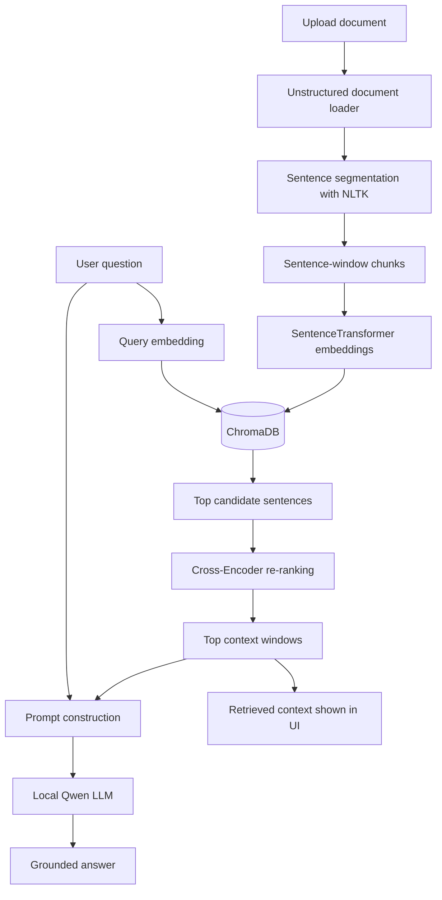

# Private RAG Document Assistant

A local Retrieval-Augmented Generation (RAG) web application for asking questions about private documents.

The project combines **Django**, **Sentence Transformers**, **ChromaDB**, a **Cross-Encoder re-ranker**, and a local **Qwen** language model to build a document-question-answering pipeline that does not require an external LLM API.

> Built as a practical portfolio project to demonstrate end-to-end RAG architecture, document processing, semantic retrieval, re-ranking, and local LLM integration.

---

## Why this project matters

Many document assistants send files or prompts to third-party AI APIs. This project explores a different approach: **document processing, retrieval, re-ranking, and answer generation run locally after the required models are downloaded**.

It demonstrates how a private knowledge assistant can be built for use cases such as:

- internal documentation;
- technical manuals;
- regulations and policies;
- research papers;
- private knowledge bases;
- offline or privacy-sensitive document analysis.

---

## Key features

- **Local LLM inference** with `Qwen/Qwen1.5-4B-Chat`
- **Semantic vector search** with `all-mpnet-base-v2`
- **Persistent vector storage** with ChromaDB
- **Two-stage retrieval pipeline**
  - vector retrieval for candidate selection;
  - Cross-Encoder re-ranking for higher relevance
- **Sentence-window chunking**
  - individual sentences are embedded for precise retrieval;
  - surrounding sentences are preserved as context windows
- **Multi-format document ingestion** through Unstructured
- **PDF, DOCX and TXT document workflows**
- **Django web interface** for uploading a document and asking questions
- **Session-based active document tracking**
- **Retrieved context display** alongside the generated answer
- **No external LLM API key required**

---

## Architecture



---

## Retrieval pipeline

The retrieval layer uses a two-stage strategy.

### 1. Vector retrieval

The user question is encoded with:

```text
sentence-transformers/all-mpnet-base-v2
```

ChromaDB retrieves a broader candidate set using semantic similarity.

Current default:

```text
Top 30 candidates
```

### 2. Cross-Encoder re-ranking

The candidates are re-scored with:

```text
cross-encoder/ms-marco-MiniLM-L-6-v2
```

The most relevant results are then selected.

Current default:

```text
Top 5 context windows
```

This design combines the speed of vector retrieval with the higher precision of pairwise re-ranking.

---

## Sentence-window chunking

Instead of embedding large fixed-size text blocks, the application indexes **individual sentences**.

For every sentence, the system also stores a context window containing nearby sentences.

```text
Previous sentences
        ↓
Target sentence  ← embedded and indexed
        ↓
Following sentences
```

The target sentence is used for retrieval, while the wider window is passed to the LLM.

This keeps retrieval granular while still providing enough surrounding context for answer generation.

---

## RAG workflow

```text
Document
   ↓
Document parsing
   ↓
Sentence segmentation
   ↓
Sentence-window creation
   ↓
Embedding generation
   ↓
ChromaDB indexing
   ↓
User question
   ↓
Vector retrieval
   ↓
Cross-Encoder re-ranking
   ↓
Relevant context
   ↓
Local Qwen model
   ↓
Grounded answer
```

---

## Tech stack

| Area | Technology |
|---|---|
| Language | Python |
| Web framework | Django |
| Local LLM | Qwen1.5-4B-Chat |
| LLM runtime | Hugging Face Transformers |
| Embeddings | Sentence Transformers / all-mpnet-base-v2 |
| Re-ranking | Cross-Encoder / ms-marco-MiniLM-L-6-v2 |
| Vector database | ChromaDB |
| Document parsing | Unstructured |
| Sentence segmentation | NLTK |
| ML runtime | PyTorch |
| Production WSGI option | Gunicorn |

---

## Project structure

```text
rag-django-project-lawrentiev/
├── config/                 # Django project configuration
├── core/
│   ├── forms.py            # Document upload and question form
│   ├── rag_logic.py        # Chunking, embeddings, retrieval, reranking and generation
│   ├── views.py            # Django request flow and ChromaDB integration
│   ├── urls.py
│   └── templates/
│       └── core/
│           └── main_page.html
├── chroma_db/              # Persistent local vector storage
├── manage.py
├── requirements.txt
├── run_qwen.py             # Standalone local Qwen test script
└── README.md
```

---

## Getting started

### Prerequisites

Recommended:

- Python 3.11
- Git
- enough RAM/disk space for local ML models
- NVIDIA GPU for faster inference, although runtime behavior depends on available hardware

The first launch may download several Hugging Face models.

### 1. Clone the repository

```bash
git clone https://github.com/alexlawren/rag-django-project-lawrentiev.git
cd rag-django-project-lawrentiev
```

### 2. Create a virtual environment

#### Windows

```powershell
python -m venv venv
.\venv\Scripts\activate
```

#### Linux / macOS

```bash
python3 -m venv venv
source venv/bin/activate
```

### 3. Install dependencies

```bash
pip install --upgrade pip
pip install -r requirements.txt
```

> Depending on the operating system and document type, Unstructured/PDF processing can require additional system packages such as Poppler or libmagic.

### 4. Apply Django migrations

```bash
python manage.py migrate
```

### 5. Start the application

```bash
python manage.py runserver
```

Open:

```text
http://127.0.0.1:8000/
```

---

## How to use

1. Start the Django application.
2. Upload a supported document.
3. Wait while the document is parsed, chunked, embedded, and stored in ChromaDB.
4. Enter a question about the active document.
5. The application:
   - retrieves semantically relevant sentences;
   - re-ranks them;
   - builds a context for the LLM;
   - generates an answer based on that context.
6. The UI also shows the retrieved context used for answering.

---

## Grounded answer generation

The generation prompt explicitly instructs the model to answer from the retrieved document context and to avoid inventing information when the context does not contain the answer.

The current implementation is configured to generate the final answer in **Russian**. This can be changed in the prompt template inside `core/rag_logic.py` for multilingual or English-first deployments.

---

## Engineering decisions

### Why local inference?

- avoids dependency on a paid LLM API;
- keeps the main document-processing and generation workflow local;
- makes the project suitable for experimenting with privacy-sensitive RAG scenarios.

### Why ChromaDB?

ChromaDB provides a lightweight persistent vector store that integrates well with Python-based RAG prototypes and local development.

### Why use a re-ranker?

Vector similarity is fast but does not always produce the best final ordering.

The Cross-Encoder evaluates the query and candidate sentence together, which can improve the relevance of the final context provided to the LLM.

### Why sentence-window retrieval?

Large chunks provide context but can reduce retrieval precision.

Sentence-level retrieval improves granularity, while context windows restore the neighboring information needed by the language model.

---

## Current scope

This repository is a working local RAG prototype focused on the core document-QA pipeline.

Areas for further development include:

- source citations with page-level metadata;
- background document processing;
- streaming token generation;
- multi-document collections;
- authentication and per-user knowledge bases;
- configurable retrieval parameters;
- automated retrieval and answer-quality evaluation;
- Docker-based deployment;
- REST API layer;
- production-ready configuration and secrets management.

---

## What this project demonstrates

From an engineering perspective, this project covers:

- end-to-end RAG pipeline design;
- local LLM integration;
- document ingestion and preprocessing;
- embedding generation;
- vector database integration;
- semantic search;
- Cross-Encoder re-ranking;
- prompt grounding;
- Django backend development;
- session-aware web workflows;
- practical integration of multiple AI/ML components into one application.

---

## Author

**Alexander Lavrentyev**

Backend developer focused on **AI automation, API integrations, RAG systems, and Python/Django development**.

GitHub: [alexlawren](https://github.com/alexlawren)
